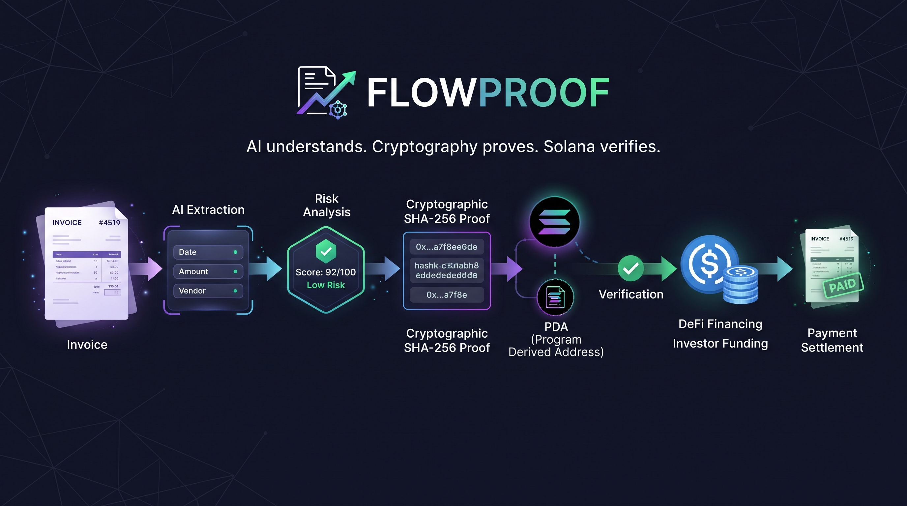

# FlowProof — Verifiable Invoice Financing on Solana

[](https://github.com/mekyto/FlowProof-Solana/actions/workflows/ci.yml)


[Solana](https://solana.com/) · [Anchor](https://www.anchor-lang.com/) · [Devnet](https://solana.com/docs/references/clusters) · [Colosseum](https://www.colosseum.org/)

> Turn real-world invoices into **verifiable on-chain financial claims** and connect invoice verification with DeFi financing.

**AI understands. Cryptography proves. Solana verifies. DeFi provides liquidity.**

[GitHub](https://github.com/mekyto/FlowProof-Solana) · [Live Demo](https://www.loom.com/share/e5fe4409113f48088e9003b3f53d3ef7) · [Video Walkthrough](https://www.loom.com/share/087706b9d4f44ff1a99b48fb0322afd9) · [Colosseum Submission](https://colosseum.com/arena/projects/flowproof)
---

# FlowProof — Verifiable Invoice Financing on Solana

<p align="center">
  
</p>

> Turn real-world invoices into **verifiable on-chain financial claims** and connect invoice verification with DeFi financing.

## Problem and Solution

### 1. Fragmented Invoice Data

* **Problem:** Invoices are stored across PDFs, emails, spreadsheets, accounting systems and internal databases. Different parties may work with different versions of the same invoice.
* **FlowProof:** Extracts structured invoice data and creates a cryptographic proof of its original state.

### 2. Invoice Modification

* **Problem:** A change to the amount, sender, receiver or other invoice data can go unnoticed.
* **FlowProof:** Generates a SHA-256 hash that acts as a fingerprint of the invoice. If the data changes, the hash changes and the mismatch can be detected.

### 3. Lack of Verifiable Shared State

* **Problem:** Businesses, payers and investors need a common way to verify the state of an invoice.
* **FlowProof:** Anchors the invoice proof on Solana through an Anchor program and PDA.

### 4. Limited Invoice Financing

* **Problem:** An invoice represents a future payment, but verifying and financing that receivable can require multiple disconnected systems.
* **FlowProof:** Connects invoice verification with a DeFi financing workflow where eligible invoices can be evaluated, funded and settled on-chain.

---

## Why Solana

* **Performance** — Solana provides the transaction throughput required for financial applications.
* **Low Cost** — Low transaction costs make frequent on-chain verification and settlement practical.
* **Programmability** — Anchor allows FlowProof to implement invoice verification and financing logic directly on-chain.
* **Stablecoins** — USDC provides a digital dollar-denominated asset for the financing workflow.
* **Composability** — Verified invoice proofs can potentially interact with other Solana DeFi and RWA protocols.

---

## Summary of Features

* AI-powered invoice data extraction
* Rule-based invoice risk analysis
* SHA-256 cryptographic proof generation
* Invoice integrity verification
* On-chain proof storage through Solana PDA
* Phantom wallet integration
* DeFi financing eligibility and quotes
* USDC investor funding workflow
* On-chain invoice settlement
* Financing marketplace prototype
* AI assistant for proofs, risks and trends

---

## Tech Stack

| Layer            | Technology              |
| ---------------- | ----------------------- |
| Blockchain       | Solana Devnet           |
| On-chain Program | Rust · Anchor 0.31.1    |
| Backend          | Node.js · Express       |
| Blockchain SDK   | `@solana/web3.js`       |
| Frontend         | HTML · CSS · JavaScript |
| Wallet           | Phantom                 |
| AI               | Gemini / Anthropic      |
| Cryptography     | SHA-256                 |
| Stablecoin       | USDC                    |
| Version Control  | Git · GitHub            |

---

## Architecture

```text
                    FLOWPROOF

┌───────────────┐
│    Invoice    │
└───────┬───────┘
        │
        ▼
┌───────────────────┐
│   AI Extraction   │
└────────┬──────────┘
         │
         ▼
┌───────────────────┐
│   Risk Analysis   │
└────────┬──────────┘
         │
         ▼
┌───────────────────┐
│  SHA-256 Proof    │
└────────┬──────────┘
         │
         ▼
┌───────────────────┐
│   Solana / PDA    │
│   Anchor Program   │
└────────┬──────────┘
         │
         ▼
┌───────────────────┐
│    Verification   │
└────────┬──────────┘
         │
         ▼
┌───────────────────┐
│  DeFi Financing   │
│      Quote        │
└────────┬──────────┘
         │
         ▼
┌───────────────────┐
│ Investor Funding  │
└────────┬──────────┘
         │
         ▼
┌───────────────────┐
│ Invoice Settlement │
└───────────────────┘
```

---

## On-Chain Program

FlowProof uses an Anchor program deployed on Solana Devnet.

**Program ID:**

```text
HZ1EBuiSJeW2MRS8pvD7r5fTJoCRPgWDyE9iEnPZ5b
```

The program currently supports:

```text
create_proof
fund
pay
cancel
```

Proof accounts are created using PDA seeds:

```text
["proof", issuer, invoice_hash]
```

Example Devnet proof:

```text
Invoice:     INV-DEFI-001
Amount:      $100
Risk Score:  10
Status:      VERIFIED
```

**Proof PDA:**

```text
FxfWWd4uqwTjwnBuZUmCPYAwM1CwK6Qh6eXxu2gyrBLi
```

---

## DeFi Financing

Once an invoice is verified, FlowProof can evaluate it for financing.

Example:

```text
Invoice Value:      100 USDC
Investor Advance:    96 USDC
Settlement:         100 USDC
Investor Yield:       4.17%
Risk Score:           10
```

The financing workflow is:

```text
Verified Invoice
       ↓
Financing Quote
       ↓
Investor
       ↓
USDC Funding
       ↓
Financed
       ↓
Payer Settlement
       ↓
Investor Receives Payment
```

This creates a programmable connection between real-world receivables and Solana-based financial infrastructure.

---

## Quick Start

**Prerequisites:** Node.js, Rust, Solana CLI, Anchor CLI, Phantom Wallet

```bash
# Clone the repository
git clone https://github.com/mekyto/FlowProof-Solana.git
cd FlowProof-Solana

# Install backend dependencies
cd backend
npm install

# Create local environment file
touch API.env

# Start backend
node --env-file=API.env server.js
```

Backend:

```text
http://localhost:3000
```

Build the Solana program:

```bash
cd ../anchor
anchor build
```

For Devnet deployment:

```bash
anchor deploy
```

Then open the frontend:

```text
frontend/index.html
```

---

## Roadmap

* [x] Invoice verification
* [x] Cryptographic proof generation
* [x] Solana on-chain proofs
* [x] Risk analysis
* [x] Financing eligibility
* [x] USDC financing workflow
* [x] Invoice settlement
* [x] DeFi marketplace prototype
* [ ] Public deployment
* [ ] Accounting / ERP integrations
* [ ] Advanced privacy and selective disclosure
* [ ] Mainnet deployment

---

## Resources

* [GitHub Repository](https://github.com/mekyto/FlowProof-Solana)
* Live Application
* Video Demo
* Colosseum Submission

---
